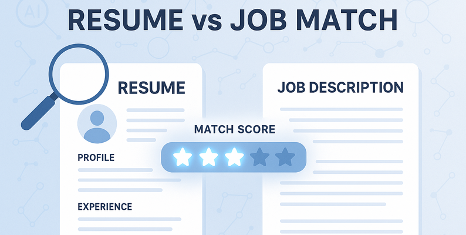

# Introduction

***
This dataset, named resume_job_matching_dataset.csv, contains information related to job descriptions, resumes, and a corresponding match score. It includes key information that is essential for analyzing the degree of compatibility between a job description and a resume.
🔍 SQL queries? Check them out [here](/queries/):
# Background
Driven by a quest to understand and analyze the performance of a resume matching system. Leveraging a comprehensive dataset of resumes and job descriptions, the aim is to pinpoint key metrics impacting the match score, identify trends, and uncover actionable insights into the system's behavior. This analysis focuses on the job description, resume, and the calculated match score to maximize understanding of the resume matching system's dynamics.
# Questions
1. How many entries (rows) are there in the dataset?
2. What is the average match_score across all entries?
3. Retrieve the job_description and resume that have the highest match_score.
4. Retrieve the job_description and resume that have the lowest match_score.
5. Count how many job_description entries contain the keyword 'SQL'.
6. Count how many resume entries mention 'Python'.
7. What is the average match_score for job descriptions that include 'Data Scientist'.
8. List all job_description and resume entries where the match_score is exactly 5.
9. Find the count of job_description entries for each unique match_score value.
10. Retrieve the top 5 job_description and resume pairs ordered by match_score in descending order.
# Tools I Used
For my deep dive into the digital advertising strategies, I harnessed the power of several key tools:
- **Pandas:** Essential python library used for data manipulation, analysis, and cleaning.
- **SQL:** The backbone of my analysis, allowing me to query the database and unearth critical insights.
- **MySQL:** The chosen database management system, ideal for handling the job posting data.
- **Visual Studio Code:** My go-to for database management and executing SQL queries.
- **Git & GitHub:** Essential for version control and sharing my SQL scripts and analysis, ensuring collaboration and project tracking.
# Database Creation
```sql
CREATE SCHEMA `resumevsjob`;
```
# Table Creation
```sql
CREATE TABLE resume(
    id INT NOT NULL AUTO_INCREMENT,
    job_description LONGTEXT,
    resume LONGTEXT,
    match_score INT,
    PRIMARY KEY (id)
);
```
# Analysis
#### What is the average match_score for job descriptions that include 'Data Scientist'.
```sql
SELECT AVG(match_score)
FROM resume
WHERE job_description LIKE "%Data Scientist%";
```
#### Retrieve the top 5 job_description and resume pairs ordered by match_score in descending order.
```sql
SELECT job_description,resume,match_score
FROM resume
ORDER BY match_score DESC
LIMIT 5;
```
#### Count how many resume entries mention 'Python'.
```sql
SELECT COUNT(*)
FROM resume
WHERE resume LIKE "%Python%";
```
#### What is the average match_score across all entries?
```sql
SELECT AVG(match_score) FROM resume;
```
The remaining queries are provided below.
[Queries](/queries/)
# What I Learned
Throughout this adventure, I've turbocharged my data analysis toolkit with some serious firepower using Pandas:
- **🧩 Advanced Data Manipulation:** Mastered the art of advanced data handling, filtering, and transforming DataFrames like a pro, wielding methods for complex data restructuring and cleaning.
- **📊 Data Aggregation:** Got cozy with groupby() and turned aggregate functions like count(), mean(), and sum() into my data-summarizing sidekicks, along with pivot_table for comprehensive data views.
- **💡 Analytical Wizardry:** Leveled up my real-world puzzle-solving skills, turning questions into actionable, insightful Pandas operations and analyses.
# Conclusion
This project, by analyzing the resume_job_matching_dataset.csv file, has provided valuable insights into understanding the system's performance and behavior. The findings from this analysis serve as a guide to identifying key factors and trends that impact the match score. Recruiters and hiring managers can gain a deeper understanding of the system's dynamics by focusing on high-impact indicators like job description quality and resume content. This exploration highlights the importance of continuous data analysis and adaptation to emerging trends in the hiring market to ensure informed decision-making and a deeper understanding of resume-job matching dynamics.
